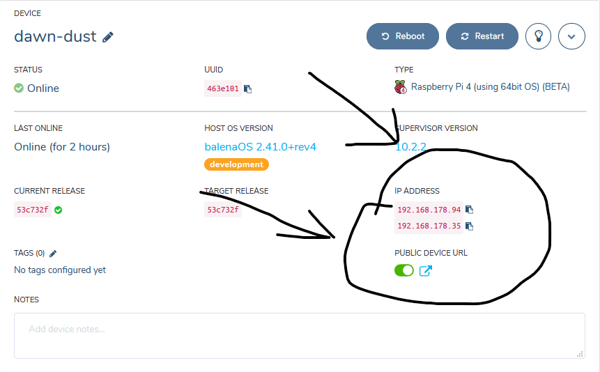
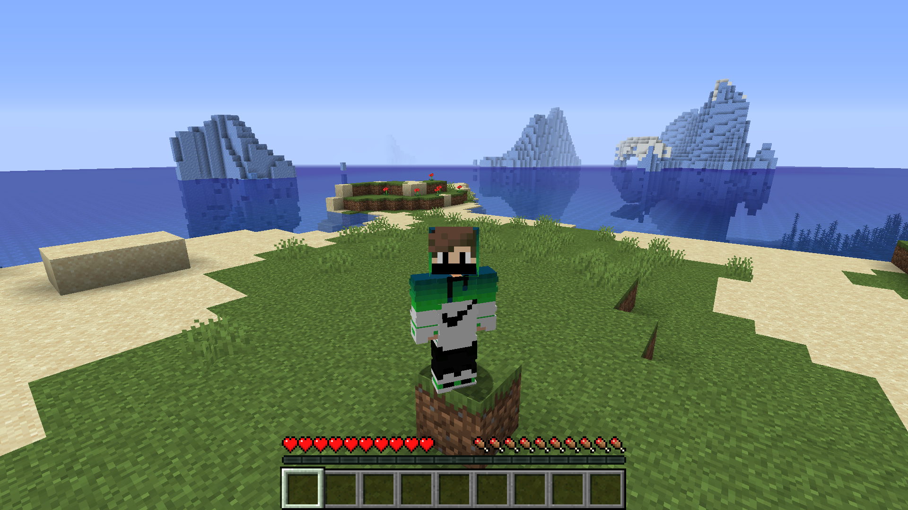
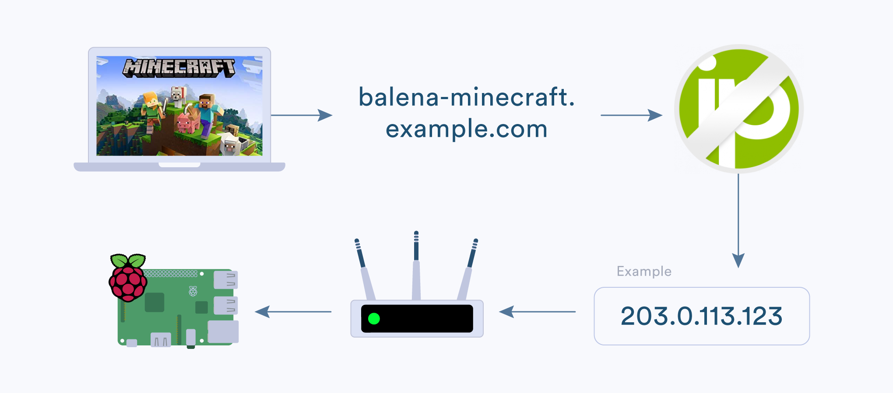

# A Minecraft server for the Raspberry Pi 4 :star2:
**Starter project enabling you a Mineccaft Server using just a Raspberry Pi.**

This project has been tested on and Raspberry Pi 4 B 4GB. We do not recommend using a Raspberry Pi 3 or deeper. They have not enough RAM and power to calculate all the things. :boom:

## Why balenaServer?

* It works out of the box, just start it and it just works. :+1:
* You can play anywhere. You can take the Pi to a friend, connect to his Wifi and enjoy playing. :video_game:
* It is free. No costs, no big server and no complication. :free:
* Why hosting on a computer? A Pi is power efficient! :rocket:
* You can easy maintain the files on the Pi by using your PC. :computer:

## Hardware required

* Raspberry Pi 4B (The best is 4GB. 1GB is not enough.) :tada:
* Micro SD Card (we recommend 8GB Sandisk Extreme Pro) :floppy_disk:
* Power supply :electric_plug:

## Software required

* A download of this project (of course)
* Software to flash an SD card ([balenaEtcher](https://balena.io/etcher))
* A free [balenaCloud](https://balena.io/cloud) account
* The [balena CLI tools](https://github.com/balena-io/balena-cli/blob/master/INSTALL.md)

## Setup and use :stars:

To run this project is as simple as deploying it to a balenaCloud application; no additional configuration is required.

### Setup the Raspberry Pi :cd:

* Sign up for or login to the [balenaCloud dashboard](https://dashboard.balena-cloud.com)
* Create an application, selecting the correct device type for your Raspberry Pi
* Add a device to the application, enabling you to download the OS
* Flash the downloaded OS to your SD card with [balenaEtcher](https://balena.io/etcher)
* Power up the Pi and check it's online in the dashboard

### Deploy this application :airplane:

* Install the [balena CLI tools](https://github.com/balena-io/balena-cli/blob/master/INSTALL.md)
* Login with `balena login`
* Download this project and from the project directory run `balena push <appName>` where `<appName>` is the name you gave your balenaCloud application in the first step.

## Connect to the server :satellite:

You can see in the Dashboard a IP-adress and a UUID. They the adress the from your server. One example:

In my case is it `192.168.178.35`or `463e101`. You can connect to it like that:

**NOTE:** Please don´t use the copy option of the UUID. If i copy i get `463e101d32c154b6d68e8ddac6eca552`. Thats wrong. Copy the short part `463e101`.

Now you are the one with a balenaServer :sunglasses::

## Connect to the terminal :satellite:

The server has no console input option in the cloud dashboard, so you need `RCON`. The port is `25575` and the password is `balenaServer`. It is a protocol for connecting to the server.
There are many clients, but you can pick one here:

* mcrcon: https://github.com/Tiiffi/mcrcon/releases

**NOTE:** You will need for starting this script this batchfile if you are using windows (Just paste it in the unzipped directory.): https://github.com/AlexProgrammerDE/RCON-Script/blob/master/launch.bat

* Minecraft Server RCON: https://mega.nz/#!SgAAyaxJ!6LQb3HMmms8QjslHH31_4SXdmIjWR-6G6H2aU_KanBY

## Connect to the file-directory :satellite:

You can connect to the server and change your serverfiles. I recommend using a Tool like [WinSCP](https://winscp.net/).
The IP is the one above, the protocoll `SCP`, the port `22`, the username `root` and the password is `balenaserver`.
The files are in the root directory folder `serverfiles`. 

## Connect to another Wifi :satellite:

balenaServer has wifi-connect integrated. You can use it for taking the Pi everywhere. If you want to read more is here the link to the programm: https://github.com/balena-io/wifi-connect (There is explained how it works.) 

## Update balenaServer :arrows_counterclockwise:

You can simply update balenaServer with doing the `git clone` and `balena` steps again.

## Double RAM (optional) :link:

Devices like the Raspberry Pi 4B 4GB have enough RAM to run the server with 2GB RAM(at defaulf 1GB). If you set `DOUBLE_RAM` to `true` will be the double of RAM used.

## Custom Server (optional) :eyeglasses:

You can also add with the scp feature new servers. You want something different, but don´t know where to start? Here are some servers listed:

* Spigot (Vanilla Java Edition): https://getbukkit.org/download/spigot
* Craftbuckit (Vanilla Java Edition): https://getbukkit.org/download/craftbukkit
* Vanilla from Minecraft (Vanilla Java Edition): https://getbukkit.org/download/vanilla
* Paper (Vanilla Java Edition): https://papermc.io/downloads
* Forge (Modded Java Edition): http://files.minecraftforge.net/
* Pocketmine-MP (Vanilla Pocket Edition): https://pmmp.readthedocs.io/en/rtfd/installation.html
* Bedrock from Microsoft (Vanilla Bedrock Edition): https://www.minecraft.net/de-de/download/server/bedrock/

Not satisfied:expressionless:? There are many tutorials, just google it. If you need help can you ask in an issue, but first google it. balenaServer uses Paper. It is a efficient and powerfull server. It is compatible with spigot and bukkit plugins.

## Play worldwide :earth_americas:

You are maybe asking yourself how this works. Here is a little explanation:

You need first to create a [No-IP account](https://www.noip.com/sign-up). Then you need to create a hostname (It is no matter what.). Then you need to [Port Forward](https://www.noip.com/support/knowledgebase/general-port-forwarding-guide/) the Port `25565` on your Pi (UDP and TCP). After this you need to Log in to NO-IP in your Router (Somewhere at Dynamic DNS). At least you need to paste the internet adress your router is saying you(NOT something like 192.168.178.xx) in the NO-IP dashoard. Youre done. :+1:

This project is in active development so if you have any feature requests or issues please submit them here on GitHub. PRs are welcome, too. :octocat:

Here is a little server demo :crown::

